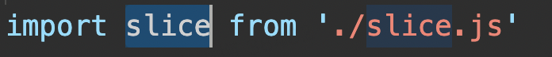
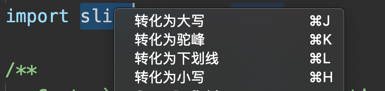

# 使用说明

## 选中需要操作的内容



## 点击鼠标右键



### 转化为大写
``` js
code
// 转换后
CODE
```

### 转化为小写
```js
  CODE
  // 转换后
  code
```

### 转化为驼峰
```js
  code_Translate
  // 转换后
  codeTranslate
```

### 转化为下划线
```js
  codeTranslate
  // 转换后
  code_Translate
```